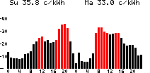

# Spotview
Finnish energy market spot prices viewer (on e-paper display, on raspberry)
**Spot** cheap hours when it is warm up your house and water boiler. Do not let russia win energy war



This software extracts hour prices from vattenfall api and displays results on EPD0213 e-paper module (black/red/white).
It is also possible to run software without display and view only .png output file.

## Command line options

```
-cache string
   	download cache dirname for downloaded price data. (prefer non-volatile location if possible) (default "/tmp/vattenfallcache")
-e int
   	number of expensive hours per 24h highlighted in red (default 6)
-nohw
   	e-paper is not available
-o string
   	outputfilename (in .png) what spotview renders on screen (default "/tmp/spotview.png")
-pinbusy string
   	busy pin name (pin8 BUSY on display) (default "GPIO24")
-pindc string
    data mode pin name (pin6 D/C on display) (default "GPIO25")
-pinreset string
    reset pin name (pin7 RESET on display) (default "GPIO17")
-spi string
    spi device file name (default "/dev/spidev0.0")
```

GPIO names are what periph.io gpio library accepts. (BCM numbering on raspberry)
This software is tested only on raspberry pi. In theory this should work on other hardware platforms also.

## Hardware

With default command line options EPD0213 e-paper module is wired with raspberry with following scheme

| physical pin | raspberry pin name | EPD0213 pin | EPD0213 pin name | cmdline option|
|--------------| -------------------|-------------|------------------|---------------|
|  1		   | 3.3V               | 1           |   3.3V POWER IN  |  |
|   any gnd    |  GND               | 2           |   VSS or GND     |  |
|  19          | SPI0 MOSI          | 3           | Serial data input| -spi |
|  23          | SPI0 CLK           | 4           |Serial clock input| -spi |
| 24           | SPI0 CE0           | 5			  | Chip select      | -spi |
| 22           | GPIO25             | 6           | D/C | -pindc |
| 11 	       | GPIO17				| 7			  | /RST | -pinreset |
| 24		   | GPIO24				| 8 | BUSY | -pinbusy |

## Deployment

Software is compatible with readonly filesystem. Write access to /tmp/ is required when using default command line parameters.
Also zoneinfo is embedded inside actual software. This prevents situation if minimal linux os lacks zoneinfo package. Software is 100% golang so CGO support is not required (CGO_ENABLED=0)

Intended use case is to use this simple as "home applicance"
1. turn raspberry on, 
2. wait for display update
3. turn system off and e-paper keeps plot on screen without consuming any power
4. repeat same thing at next day

There is no shutdown feature on software. Turning raspberry (or any embedded system) off with proper shutdown can cause problems with disk/sdcard/etc... For that reason it is prefered to use linux distribution with readonly filesystem.

### gokrazy
For raspberry pi, the easiest way to go is to use gokrazy.

Follow gokrazy installation instructions


Check that gokrazy binaries are found from **GOBIN** path
Insert sdcard and figure out where sdcard is found. (umount if os like ubuntu is automounting)

Then create empty directory, cd to there and give command, where sdX is like sdb if your sdcard is found from there
```
gokr-packer -overwrite=/dev/sdX github.com/hjkoskel/spotview
```
Wait and remove sdcard from PC.
Then connect EPD0213 to raspberry. Connect ethernet (follow gokrazy instructions is wlan is needed) and power up and wait.

### TBD

TODO other distros and custom made lightweight linux distros.